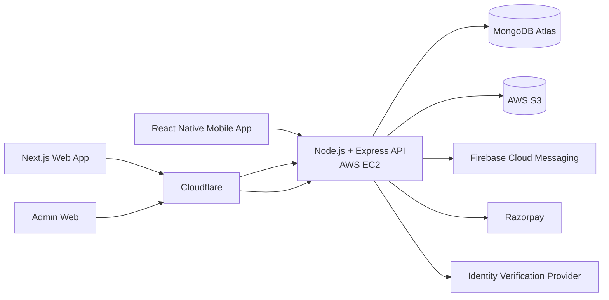
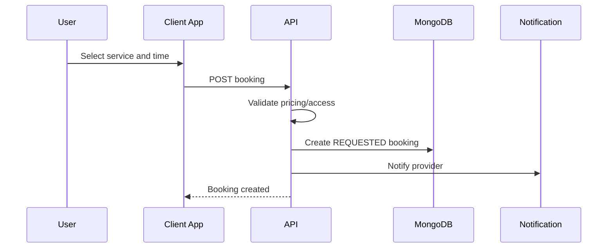
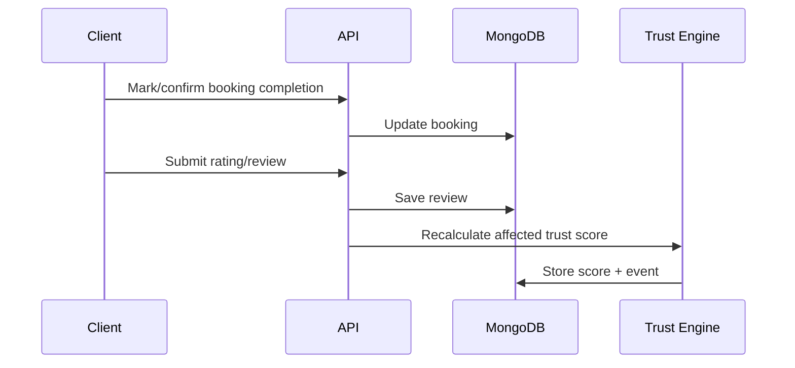

# FindBuddy — High-Level Design (HLD)

**Product:** FindBuddy  
**Business Entity:** The Logic Machines  
**Document:** High-Level Design  
**Version:** 1.0 — LOCKED FOR MVP  
**Architecture Principle:** Low-cost, production-ready, modular, scalable without premature microservices

---

# 1. Purpose

This HLD defines the locked technical architecture for the FindBuddy mobile application and web application based on the approved MVP/BRD.

The system must support:

- Free and Pro users.
- Buddy service creation and booking.
- Free-user pricing limit of ₹500 per service/session.
- Pro-user per-hour pricing and pricing above the Free limit.
- Plans and group plans.
- Ratings and reviews.
- Trust Score.
- Admin-controlled Trust Score adjustments.
- Booking recommendation states.
- Aadhaar-based verification through an external compliant verification provider.
- Women-safety functions defined in the BRD.
- Chat.
- Payments and ₹299/month subscription.
- Notifications.
- Admin dashboard.

No additional consumer-facing product scope is introduced in this HLD.

---

# 2. Locked Technology Stack

| Layer | Locked Technology |
|---|---|
| Mobile | React Native + TypeScript |
| Mobile framework | Expo / Expo Router with native prebuild capability |
| Web | Next.js + TypeScript |
| Web styling | Tailwind CSS |
| Web data fetching | TanStack Query |
| Mobile data fetching | TanStack Query |
| Shared client state | Zustand only where server-state is not appropriate |
| Backend | Node.js + Express + TypeScript |
| Backend architecture | Modular Monolith |
| Database | MongoDB Atlas |
| ODM | Mongoose |
| Validation | Zod |
| API style | REST JSON |
| Realtime | Socket.IO |
| Media storage | AWS S3 |
| Mobile push | Firebase Cloud Messaging |
| Payments | Razorpay |
| Aadhaar/identity verification | External compliant verification provider behind an adapter |
| Backend hosting | AWS EC2 |
| Web hosting | Cloudflare Workers via vinext |
| DNS / edge | Cloudflare |
| Reverse proxy | Nginx |
| Runtime packaging | Docker + Docker Compose |
| Source control | GitHub |
| CI/CD | GitHub Actions |
| API documentation | OpenAPI / Swagger |
| Logging | Structured JSON logs |
| Testing | Vitest/Jest + Supertest; React Testing Library; Playwright |
| Package manager | pnpm |
| Monorepo | Turborepo + pnpm workspaces |

---

# 3. Architecture Style

## 3.1 Modular Monolith

FindBuddy will start as a modular monolith.

All backend modules run in the same Node.js application and deployment unit, but each business domain is isolated through explicit module boundaries.

Benefits:

- Lowest infrastructure cost.
- One EC2 deployment.
- One codebase for backend.
- No network overhead between business modules.
- Easier local development.
- Easier transactions and debugging.
- Clear future extraction path if a module later needs to become a separate service.

The system will **not** use microservices during MVP.

---

# 4. Repository Architecture

A single monorepo will be used.

```text
findbuddy/
├── apps/
│   ├── api/                 # Node.js + Express backend
│   ├── web/                 # Next.js web app + admin
│   └── mobile/              # React Native / Expo
│
├── packages/
│   ├── contracts/           # shared API types/schemas
│   ├── config/              # shared TS/eslint/prettier config
│   └── utils/               # safe platform-independent utilities
│
├── infra/
│   ├── docker/
│   ├── nginx/
│   └── scripts/
│
├── docs/
│   ├── api/
│   └── architecture/
│
├── .github/
│   └── workflows/
│
├── turbo.json
├── pnpm-workspace.yaml
└── package.json
```

Important rule:

- UI components are **not automatically shared** between Next.js and React Native because their rendering platforms differ.
- API contracts, enums, validation-safe schemas, constants, and domain types can be shared.

---

# 5. System Context



---

# 6. Client Applications

## 6.1 Mobile Application

Technology:

- React Native.
- TypeScript.
- Expo Router.
- TanStack Query.
- SecureStore for refresh token / sensitive session information.
- FCM for push notifications.

Primary mobile responsibilities:

- User onboarding.
- Profile management.
- Browse/search.
- Service listing.
- Booking.
- Plans.
- Chat.
- Subscription/payment.
- Verification flow.
- Safety actions.
- Ratings/reviews.
- Trust Score display.

Mobile must consume the same REST API used by web.

---

## 6.2 Web Application

Technology:

- Next.js.
- TypeScript.
- Tailwind CSS.
- TanStack Query.

Web contains:

- Public pages.
- User application functionality.
- Authentication.
- User dashboard.
- Admin dashboard protected through RBAC.

Deployment:

- Cloudflare Workers using **vinext** for the Next.js deployment runtime.
- Static/public content should be cached at the edge where safe.
- Authenticated API data must come from the backend and must not be publicly edge-cached.

---

# 7. Backend Deployment Architecture

MVP production deployment:

```text
Internet
   |
Cloudflare DNS / Proxy
   |
api.findbuddy.<domain>
   |
AWS EC2
   |
Nginx
   |
Docker Compose
   |
Node.js Express API
   |
   +---- MongoDB Atlas
   +---- AWS S3
   +---- Razorpay
   +---- FCM
   +---- Verification Provider
```

## Locked EC2 approach

Initial server:

- One production EC2 instance.
- Ubuntu LTS.
- ARM-based instance preferred if all dependencies support ARM.
- Recommended starting class: **t4g.small**.
- gp3 EBS.
- Security group allows only:
  - 22 from restricted administration source where possible.
  - 80/443 as required.
- Application port is not directly exposed publicly.

The EC2 server will run:

- Nginx.
- API Docker container.

MongoDB will **not** run on EC2.

User-uploaded images will **not** be stored on EC2 filesystem.

---

# 8. Domain Architecture

Backend modules:

```text
auth
users
profiles
services
plans
bookings
chat
payments
subscriptions
verification
trust-score
reviews
safety
notifications
admin
media
```

Each module owns:

- Routes.
- Controller.
- Service/business logic.
- Repository/data-access functions.
- Schemas/validators.
- Types.
- Tests.

Cross-module calls must go through module services rather than directly importing another module's database model wherever practical.

---

# 9. Authentication Architecture

Authentication type:

- Email + password.
- Email verification.
- Access token + refresh token.

Access token:

- Short-lived JWT.
- Sent as Bearer token for mobile.
- Web may use secure HTTP-only session/refresh cookie strategy.

Refresh token:

- Long-lived.
- Rotated.
- Stored hashed in database.
- Revocable.

Password:

- Hashed using Argon2id or equivalent secure password hashing.
- Never logged.
- Never stored in plain text.

Roles:

```text
USER
PRO_USER
ADMIN
SUPER_ADMIN
```

Subscription status and role are separate concepts where possible so expiry does not corrupt authorization history.

---

# 10. Authorization

Authorization uses:

- Role-Based Access Control.
- Resource ownership checks.

Examples:

- User can modify only their own profile.
- Provider can accept/reject booking requests directed to their service.
- Plan creator can accept/reject join requests.
- Admin can moderate.
- Super Admin can manage platform-level configuration/admin users.

Admin endpoints must be namespaced separately.

```text
/api/v1/admin/*
```

---

# 11. MongoDB Architecture

MongoDB Atlas is the source of truth.

Primary collections:

```text
users
profiles
services
plans
planJoinRequests
bookings
conversations
messages
reviews
trustScores
trustScoreEvents
verificationRequests
subscriptions
payments
reports
safetyEvents
deviceTokens
notifications
adminAuditLogs
refreshTokens
media
```

Indexes must be designed from access patterns, not added randomly.

Core index examples:

- users.email unique.
- profiles.userId unique.
- services.providerId.
- services.city + category + status.
- bookings.consumerId + createdAt.
- bookings.providerId + createdAt.
- plans.city + date + status.
- messages.conversationId + createdAt.
- reviews.revieweeId + createdAt.
- trustScoreEvents.userId + createdAt.

---

# 12. Media Architecture

Images are stored in AWS S3.

Flow:

```text
Client
  |
  | request upload authorization
  v
API
  |
  | generates presigned upload URL
  v
Client ------------------> S3
                            |
                            | object key
                            v
                          API/DB
```

Rules:

- Client uploads directly to S3.
- Backend must not proxy large image uploads.
- Database stores object key / canonical media reference, not raw image bytes.
- S3 bucket blocks arbitrary public write.
- Uploads use short-lived signed URLs.
- Allowed MIME types and file-size limits are validated.
- Image ownership is stored.

This reduces EC2 bandwidth and memory usage.

---

# 13. Search and Discovery

MVP search uses MongoDB indexes.

Filters:

- Service category.
- City/location.
- Price.
- Rating.
- Verification status.
- Trust Score.
- Availability.

No Elasticsearch/OpenSearch in MVP.

Search logic should be wrapped behind a search service interface so an external search engine can be introduced later without changing API contracts.

---

# 14. Booking Architecture

Booking lifecycle:

```text
REQUESTED
   |
   +--> REJECTED
   |
   +--> ACCEPTED
           |
           +--> CANCELLED
           |
           +--> COMPLETED
```

Booking stores a snapshot of important service details at booking time so later service edits do not alter historical bookings.

Snapshot includes:

- Service title.
- Pricing type.
- Price.
- Provider.
- Requested date/time.

---

# 15. Plan Architecture

Plan lifecycle:

```text
DRAFT
  |
PUBLISHED
  |
  +--> CANCELLED
  |
  +--> COMPLETED
```

Join request lifecycle:

```text
PENDING
  |
  +--> ACCEPTED
  |
  +--> REJECTED
  |
  +--> CANCELLED
```

Plans can be free or paid as specified in the BRD.

---

# 16. Chat Architecture

MVP uses Socket.IO in the same backend application.

```text
Mobile/Web
    |
WebSocket / Socket.IO
    |
Node API on EC2
    |
MongoDB messages
```

Chat messages are persisted.

Conversation access is authorized based on the relevant booking or plan relationship.

MVP does not require Redis because there is only one backend instance.

When backend is horizontally scaled later:

```text
Socket.IO instances
      |
Redis Adapter
      |
Shared realtime state
```

Redis is explicitly **deferred**, not part of MVP infrastructure.

---

# 17. Payments Architecture

Razorpay integration covers:

- Paid services.
- Paid plans where applicable.
- ₹299/month Pro subscription.

Payment flow:

```text
Client
  |
Create Payment Intent/Order
  |
API
  |
Razorpay
  |
Client completes payment
  |
Razorpay Webhook
  |
API verifies signature
  |
DB payment status updated
```

Critical rule:

**Client payment success response is never trusted as the final source of truth.**

Server-side verified webhook/signature is authoritative.

---

# 18. Subscription Architecture

Subscription states:

```text
PENDING
ACTIVE
PAST_DUE
CANCELLED
EXPIRED
```

Pro entitlement is determined by valid subscription state and validity dates.

The application must not permanently change a user's account role merely because one payment succeeded.

Entitlements are derived from subscription records.

---

# 19. Verification Architecture

Aadhaar verification will not be implemented by storing Aadhaar data directly inside FindBuddy.

The backend exposes a provider-independent abstraction:

```text
IdentityVerificationProvider
  ├── initiateVerification()
  ├── getStatus()
  └── handleWebhook()
```

FindBuddy stores only what is operationally necessary:

- Internal verification request id.
- External provider reference.
- Status.
- Verification timestamps.
- Minimal masked/derived metadata where legally appropriate.

Public profile exposes only:

- Verified / Not Verified.
- Verified badge.

Raw Aadhaar images/numbers must not be publicly exposed or logged.

---

# 20. Trust Score Architecture

Trust Score range:

```text
0 - 100
```

Sources defined in BRD:

- Successful completed bookings.
- Positive ratings.
- Repeat bookings.
- Profile verification.
- Aadhaar verification.
- Good booking history.
- Low cancellation rate.
- Positive platform behaviour.
- Poor ratings.
- Confirmed complaints.
- Safety reports.
- Suspicious platform activity.
- Manual Admin adjustments.

Trust Score is stored as:

```text
computedScore
manualAdjustment
finalScore
```

Every score-changing event is separately recorded.

```text
TrustScoreEvent
```

This gives auditability and allows recalculation.

Admin changes require:

- Admin id.
- User id.
- Delta/change.
- Reason.
- Timestamp.

Direct user purchase of Trust Score is not supported.

---

# 21. Booking Recommendation Architecture

Recommendation states:

```text
RECOMMENDED
PROCEED_WITH_CAUTION
NOT_RECOMMENDED
```

Inputs:

- Trust Score.
- Verification status.
- Ratings.
- Completed booking count.
- Repeat booking count.
- Cancellation history.
- Reports/complaints.

The recommendation engine is deterministic and explainable.

It must return:

```json
{
  "state": "RECOMMENDED",
  "reasons": [
    "Identity verified",
    "High trust score",
    "Strong completed booking history"
  ]
}
```

Thresholds remain configurable server-side.

The recommendation is advisory, not a guarantee of safety.

---

# 22. Safety Architecture

BRD safety features remain:

- Verified-only filter.
- Women-only visibility option.
- Block.
- Report.
- SOS.
- Trusted contact.
- Meetup check-in.
- Meetup check-out.
- Public-place suggestion.

Safety events are auditable.

Relevant collections:

```text
reports
safetyEvents
blocks
```

High-severity reports can influence:

- Trust Score.
- Recommendation state.
- Account moderation.

Admin moderation remains the final platform control.

---

# 23. Notifications Architecture

Notification channels in MVP:

- In-app notifications.
- Mobile push using FCM.

Events:

- Booking request.
- Booking accepted/rejected.
- Plan join request.
- Join request accepted/rejected.
- Chat message.
- Booking reminder.
- Rating request.
- Verification status.
- Subscription status.

Notification creation occurs through a notification service interface.

No dedicated message queue initially.

Async jobs can run through controlled in-process/background workers for MVP.

If volume grows, a proper queue can be introduced later.

---

# 24. API Architecture

Base URL:

```text
https://api.findbuddy.<domain>/api/v1
```

API standards:

- REST.
- JSON.
- Versioned routes.
- Consistent success/error envelope.
- Zod validation.
- Swagger/OpenAPI.
- Pagination for list endpoints.
- Idempotency for sensitive payment operations.
- Rate limiting on auth and high-risk endpoints.

Response example:

```json
{
  "success": true,
  "data": {},
  "meta": {}
}
```

Error example:

```json
{
  "success": false,
  "error": {
    "code": "BOOKING_NOT_FOUND",
    "message": "Booking not found"
  }
}
```

---

# 25. API Versioning

MVP uses:

```text
/api/v1/
```

Breaking API changes require a new version.

Mobile apps may remain installed for long periods, so backward compatibility is especially important.

---

# 26. Security Architecture

Required controls:

- HTTPS only.
- Cloudflare in front of public web/API DNS.
- Nginx reverse proxy.
- Secure headers.
- Input validation.
- Password hashing.
- JWT rotation.
- Refresh token revocation.
- Rate limiting.
- RBAC.
- Ownership checks.
- Webhook signature verification.
- S3 presigned uploads.
- MIME and size validation.
- Sensitive-data redaction from logs.
- Audit logs for admin actions.
- MongoDB network/IP restrictions.
- EC2 IAM role instead of long-lived AWS access keys where possible.
- Secrets outside Git repository.

---

# 27. Secret Management

Production secrets must not live in GitHub source code or committed `.env` files.

Production configuration includes:

- MongoDB URI.
- JWT secrets/keys.
- Razorpay secrets.
- Firebase credentials.
- Verification provider secrets.
- S3 bucket configuration.

On EC2:

- Use environment injection from protected deployment configuration / AWS systems.
- Application receives secrets at runtime.

---

# 28. Logging and Observability

MVP logging:

- Structured JSON logs.
- Request id/correlation id.
- Timestamp.
- Route.
- Status.
- Latency.
- Safe user id reference.
- Error code.

Never log:

- Passwords.
- Full tokens.
- Aadhaar details.
- Payment credentials.

Health endpoints:

```text
GET /health/live
GET /health/ready
```

Ready check should validate critical application readiness without exposing secrets.

---

# 29. Error Handling

One central Express error middleware.

Errors grouped into:

- Validation error.
- Authentication error.
- Authorization error.
- Not found.
- Conflict.
- Business-rule error.
- External-provider error.
- Internal server error.

Production responses must not return stack traces.

---

# 30. Code Quality Standards

Mandatory:

- TypeScript strict mode.
- ESLint.
- Prettier.
- Import sorting.
- No implicit `any`.
- No controller business logic.
- No raw database logic inside routes.
- Central validation.
- Central error handling.
- Reusable domain enums.
- Service/repository separation.
- Unit tests for scoring/payment/business rules.
- Integration tests for critical APIs.
- Pull-request checks before merge.

Git hooks:

- lint-staged.
- formatting.
- lint.
- typecheck.

---

# 31. Testing Strategy

## Backend

- Unit tests:
  - Trust Score.
  - Recommendation engine.
  - Pricing permissions.
  - Subscription entitlement.
- Integration tests:
  - Auth.
  - Booking.
  - Plans.
  - Payment webhook.
  - Verification webhook.
  - Reviews.
  - Admin Trust Score adjustment.

## Web

- Component tests.
- Critical user-flow tests.
- Admin permissions.

## Mobile

- Component tests.
- Authentication flow.
- Booking flow.
- Plan flow.

## End-to-End

Playwright for web/admin critical flows.

---

# 32. CI/CD

GitHub workflow:

```text
Pull Request
  |
  +--> install
  +--> lint
  +--> typecheck
  +--> unit tests
  +--> build
```

Production API deploy:

```text
main branch
  |
GitHub Actions
  |
SSH to EC2
  |
pull/build Docker image
  |
docker compose up -d
  |
health check
```

Web:

```text
GitHub
  |
Cloudflare deployment
```

Mobile:

- Build Android application from tagged/release branch.
- Release through Google Play Console.

---

# 33. Docker Architecture

Production backend Docker Compose:

```text
services:
  nginx
  api
```

Database is external MongoDB Atlas.

S3, FCM, Razorpay, and verification provider are external managed services.

No local MongoDB container in production.

---

# 34. Environments

Required environments:

```text
local
staging
production
```

At minimum:

- Local developer environment.
- Production environment.

Before public launch, staging should be enabled using separate:

- Database.
- payment/test keys.
- verification/test keys.
- bucket prefix/bucket.

Never use production payment or KYC credentials in local development.

---

# 35. Scaling Strategy

## Stage 1 — MVP

```text
1 EC2
1 API container
MongoDB Atlas
S3
Cloudflare
```

## Stage 2 — More Traffic

- Increase EC2 size.
- Optimize MongoDB indexes.
- Add CDN media optimization if required.
- Add Redis only when a real need appears.

## Stage 3 — Horizontal Scale

```text
Load Balancer
   |
Multiple API instances
   |
Redis for Socket.IO / shared cache
   |
MongoDB Atlas scaled tier
```

## Stage 4 — Extract only proven hotspots

Possible module extraction only if metrics justify it:

- Chat/realtime.
- Notifications.
- Media processing.

Microservices are not pre-committed.

---

# 36. Cost-Control Decisions

Cost is reduced by:

- Single EC2 backend.
- No Kubernetes.
- No ECS during MVP.
- No Redis initially.
- No Kafka.
- No Elasticsearch/OpenSearch.
- MongoDB Atlas managed tier.
- S3 direct uploads.
- Cloudflare-hosted web.
- FCM for push.
- GitHub Actions for CI/CD.
- Modular monolith instead of multiple services.

---

# 37. High-Level Data Flow

## Book a Buddy



## Complete Booking and Trust Update



---

# 38. Availability and Backup

MVP target is practical availability, not enterprise multi-region HA.

Required:

- MongoDB Atlas managed backups according to selected tier.
- EC2 image/config reproducibility through Docker and Git.
- S3 durability.
- Infrastructure configuration documented.
- Database and media are external to EC2 so server replacement does not destroy business data.

---

# 39. Locked Architecture Decisions

The following are locked for MVP:

1. React Native for mobile.
2. Next.js for web/admin.
3. Node.js + Express + TypeScript backend.
4. MongoDB Atlas.
5. Mongoose.
6. REST API.
7. Modular monolith.
8. AWS EC2 backend deployment.
9. AWS S3 media storage.
10. Cloudflare for web/DNS/edge.
11. Socket.IO chat.
12. Razorpay payments.
13. FCM notifications.
14. External provider adapter for Aadhaar verification.
15. Docker + Docker Compose.
16. GitHub Actions CI/CD.
17. No Redis initially.
18. No microservices initially.
19. No Kubernetes.
20. No Elasticsearch/OpenSearch during MVP.

Any change to these decisions should be treated as an architecture change and documented before implementation.
